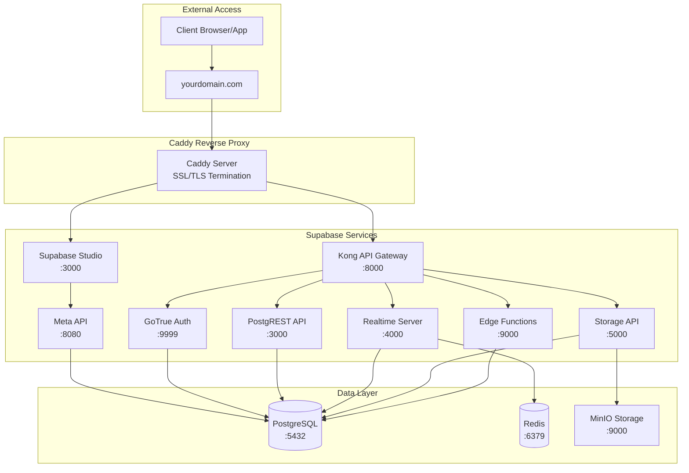
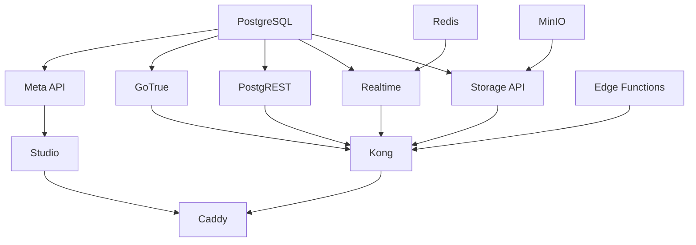

# Self-Hosted Supabase Implementation Plan

## Executive Summary

This document outlines a comprehensive plan to implement a self-hosted Supabase instance using Docker, designed as a reusable template for future projects. The implementation includes Supabase Studio, Authentication (GoTrue), Storage, Edge Functions, and Caddy as a reverse proxy for SSL/TLS termination.

## Table of Contents

1. [Architecture Overview](#architecture-overview)
2. [Core Components](#core-components)
3. [Implementation Strategy](#implementation-strategy)
4. [Environment Configuration](#environment-configuration)
5. [Multi-Instance Isolation Strategy](#multi-instance-isolation-strategy)
6. [Network Architecture](#network-architecture)
7. [Security Considerations](#security-considerations)
8. [Deployment Workflows](#deployment-workflows)
9. [Backup and Recovery](#backup-and-recovery)
10. [Monitoring and Maintenance](#monitoring-and-maintenance)
11. [Implementation Checklist](#implementation-checklist)

---

## Architecture Overview

### System Design Philosophy

The implementation follows these core principles:

- **Environment Parity**: Identical structure for local development and production
- **Security by Default**: All secrets managed via environment variables
- **Data Persistence**: All critical data stored in Docker volumes with backup strategies
- **Scalability**: Modular design allowing easy addition of services
- **Simplicity**: Minimal complexity while maintaining production-readiness

### High-Level Architecture



---

## Core Components

### 1. Supabase Services

#### PostgreSQL Database
- **Purpose**: Primary data store for all Supabase services
- **Version**: PostgreSQL 15+ with required extensions
- **Extensions Required**:
  - `uuid-ossp`: UUID generation
  - `pgcrypto`: Cryptographic functions
  - `pgjwt`: JWT token generation
  - `pg_net`: HTTP client for database
  - `pgsodium`: Encryption library
  - `pg_graphql`: GraphQL support
  - `pg_stat_statements`: Query performance monitoring

#### Kong API Gateway
- **Purpose**: Central API gateway and request routing
- **Port**: 8000 (HTTP), 8443 (HTTPS)
- **Features**:
  - Request routing to backend services
  - Rate limiting
  - Authentication middleware
  - CORS handling

#### Supabase Studio
- **Purpose**: Web-based database management interface
- **Port**: 3000
- **Features**:
  - Table editor
  - SQL editor
  - API documentation
  - Authentication management
  - Storage browser

#### GoTrue (Authentication)
- **Purpose**: User authentication and management
- **Port**: 9999
- **Features**:
  - Email/password authentication
  - OAuth providers (Google, GitHub, etc.)
  - Magic link authentication
  - JWT token management
  - User metadata storage

#### PostgREST
- **Purpose**: Automatic REST API from PostgreSQL schema
- **Port**: 3000
- **Features**:
  - Auto-generated REST endpoints
  - Row-level security enforcement
  - OpenAPI documentation
  - Filtering and pagination

#### Realtime Server
- **Purpose**: WebSocket connections for real-time updates
- **Port**: 4000
- **Features**:
  - Database change subscriptions
  - Broadcast channels
  - Presence tracking
  - PostgreSQL replication slot integration

#### Storage API
- **Purpose**: Object storage management
- **Port**: 5000
- **Backend**: MinIO (S3-compatible)
- **Features**:
  - File upload/download
  - Image transformations
  - Access control policies
  - Signed URLs

#### Edge Functions (Deno Runtime)
- **Purpose**: Serverless function execution
- **Port**: 9000
- **Features**:
  - TypeScript/JavaScript execution
  - HTTP triggers
  - Database access
  - Third-party API integration

#### Meta API
- **Purpose**: Database metadata and migrations
- **Port**: 8080
- **Features**:
  - Schema introspection
  - Migration management
  - Database health checks

### 2. Supporting Services

#### Redis
- **Purpose**: Caching and session storage
- **Port**: 6379
- **Use Cases**:
  - Realtime server message queue
  - Rate limiting cache
  - Session storage

#### MinIO
- **Purpose**: S3-compatible object storage
- **Ports**: 9000 (API), 9001 (Console)
- **Features**:
  - S3-compatible API
  - Multi-tenant support
  - Bucket policies
  - Web console

#### Caddy
- **Purpose**: Reverse proxy and SSL/TLS termination
- **Ports**: 80 (HTTP), 443 (HTTPS)
- **Features**:
  - Automatic HTTPS with Let's Encrypt
  - HTTP/2 and HTTP/3 support
  - Reverse proxy with load balancing
  - Access logging

---

## Implementation Strategy

### Phase 1: Foundation Setup

#### Directory Structure

```
supabase-template/
├── docker/
│   ├── .env.example              # Template environment file
│   ├── .env                      # Actual environment (gitignored)
│   ├── docker-compose.yml        # Main compose file
│   ├── docker-compose.local.yml  # Local development overrides
│   ├── docker-compose.prod.yml   # Production overrides
│   ├── start.sh                  # Start script
│   ├── stop.sh                   # Stop script
│   └── volumes/                  # Volume initialization scripts
│       ├── postgres/
│       │   └── init.sql          # Database initialization
│       └── minio/
│           └── init.sh           # Storage bucket setup
├── caddy/
│   ├── Caddyfile.local           # Local development config
│   ├── Caddyfile.prod            # Production config
│   └── data/                     # Caddy data (certificates, etc.)
├── scripts/
│   ├── backup.sh                 # Backup script
│   ├── restore.sh                # Restore script
│   ├── deploy.sh                 # Deployment script
│   └── health-check.sh           # Health check script
├── docs/
│   ├── SETUP.md                  # Setup instructions
│   ├── DEPLOYMENT.md             # Deployment guide
│   ├── TROUBLESHOOTING.md        # Common issues
│   └── API_REFERENCE.md          # API documentation
├── .gitignore
└── README.md
```

### Phase 2: Docker Compose Configuration

#### Service Dependencies



#### Startup Order

1. **Infrastructure Layer** (no dependencies)
   - PostgreSQL
   - Redis
   - MinIO

2. **Core Services Layer** (depends on infrastructure)
   - Meta API
   - GoTrue
   - PostgREST
   - Realtime
   - Storage API
   - Edge Functions

3. **Gateway Layer** (depends on core services)
   - Kong API Gateway
   - Supabase Studio

4. **Proxy Layer** (depends on gateway)
   - Caddy

### Phase 3: Environment Configuration

#### Environment Variable Categories

**1. Project Configuration**
```bash
# CRITICAL: Must be unique for each instance to prevent container/volume/network clashes
PROJECT_NAME=supabase_template  # Change for each project: customer_a, customer_b, etc.
ENVIRONMENT=local  # or production

# Port offset for running multiple instances (optional, see Multi-Instance Isolation section)
PORT_OFFSET=0  # 0 for first instance, 100 for second, 200 for third, etc.
```

**2. Database Configuration**
```bash
POSTGRES_PASSWORD=<strong-random-password>
POSTGRES_DB=postgres
POSTGRES_USER=postgres
POSTGRES_PORT=5432
```

**3. Authentication Configuration**
```bash
JWT_SECRET=<256-bit-secret>
ANON_KEY=<jwt-token-with-anon-role>
SERVICE_ROLE_KEY=<jwt-token-with-service-role>
SITE_URL=http://localhost:3000
ADDITIONAL_REDIRECT_URLS=
JWT_EXPIRY=3600
```

**4. Storage Configuration**
```bash
STORAGE_BACKEND=s3
STORAGE_S3_ENDPOINT=http://minio:9000
STORAGE_S3_BUCKET=supabase-storage
MINIO_ROOT_USER=minioadmin
MINIO_ROOT_PASSWORD=<strong-random-password>
```

**5. Email Configuration**
```bash
SMTP_HOST=smtp.example.com
SMTP_PORT=587
SMTP_USER=noreply@example.com
SMTP_PASS=<smtp-password>
SMTP_ADMIN_EMAIL=admin@example.com
```

**6. Domain Configuration**
```bash
# Local Development
API_EXTERNAL_URL=http://localhost:8000
STUDIO_EXTERNAL_URL=http://localhost:3000

# Production
API_EXTERNAL_URL=https://api.yourdomain.com
STUDIO_EXTERNAL_URL=https://studio.yourdomain.com
```

---

## Multi-Instance Isolation Strategy

### Overview

To support running multiple Supabase instances simultaneously without conflicts, the template implements a comprehensive isolation strategy using unique project names and dynamic port allocation.

### Container and Resource Naming

#### PROJECT_NAME as Isolation Key

All Docker resources (containers, volumes, networks) are prefixed with `${PROJECT_NAME}` to ensure complete isolation:

```yaml
# docker-compose.yml example
services:
  db:
    container_name: ${PROJECT_NAME}_db
    volumes:
      - ${PROJECT_NAME}_db_data:/var/lib/postgresql/data
    networks:
      - ${PROJECT_NAME}_network

volumes:
  ${PROJECT_NAME}_db_data:
    name: ${PROJECT_NAME}_db_data

networks:
  ${PROJECT_NAME}_network:
    name: ${PROJECT_NAME}_network
```

#### Naming Convention Examples

```bash
# Instance 1: Customer A
PROJECT_NAME=customer_a_supabase
# Creates: customer_a_supabase_db, customer_a_supabase_kong, etc.

# Instance 2: Customer B  
PROJECT_NAME=customer_b_supabase
# Creates: customer_b_supabase_db, customer_b_supabase_kong, etc.

# Instance 3: Development
PROJECT_NAME=dev_supabase
# Creates: dev_supabase_db, dev_supabase_kong, etc.
```

### Port Management Strategy

#### Dynamic Port Allocation

To prevent port conflicts when running multiple instances, use the `PORT_OFFSET` environment variable:

```bash
# Instance 1 (default ports)
PROJECT_NAME=customer_a_supabase
PORT_OFFSET=0
# PostgreSQL: 5432, Kong: 8000, Studio: 3000, etc.

# Instance 2 (offset by 100)
PROJECT_NAME=customer_b_supabase
PORT_OFFSET=100
# PostgreSQL: 5532, Kong: 8100, Studio: 3100, etc.

# Instance 3 (offset by 200)
PROJECT_NAME=dev_supabase
PORT_OFFSET=200
# PostgreSQL: 5632, Kong: 8200, Studio: 3200, etc.
```

#### Port Mapping Implementation

```yaml
# docker-compose.yml with dynamic ports
services:
  db:
    container_name: ${PROJECT_NAME}_db
    ports:
      - "127.0.0.1:${POSTGRES_PORT:-5432}:5432"
    environment:
      - POSTGRES_PORT=${POSTGRES_PORT:-5432}
  
  kong:
    container_name: ${PROJECT_NAME}_kong
    ports:
      - "127.0.0.1:${KONG_HTTP_PORT:-8000}:8000"
      - "127.0.0.1:${KONG_HTTPS_PORT:-8443}:8443"
  
  studio:
    container_name: ${PROJECT_NAME}_studio
    ports:
      - "127.0.0.1:${STUDIO_PORT:-3000}:3000"
  
  minio:
    container_name: ${PROJECT_NAME}_minio
    ports:
      - "127.0.0.1:${MINIO_PORT:-9000}:9000"
      - "127.0.0.1:${MINIO_CONSOLE_PORT:-9001}:9001"
```

#### Environment Variable Configuration

```bash
# .env file with PORT_OFFSET calculation
PROJECT_NAME=customer_a_supabase
PORT_OFFSET=0

# Calculated ports (can be automated in start script)
POSTGRES_PORT=$((5432 + PORT_OFFSET))
KONG_HTTP_PORT=$((8000 + PORT_OFFSET))
KONG_HTTPS_PORT=$((8443 + PORT_OFFSET))
STUDIO_PORT=$((3000 + PORT_OFFSET))
MINIO_PORT=$((9000 + PORT_OFFSET))
MINIO_CONSOLE_PORT=$((9001 + PORT_OFFSET))
REDIS_PORT=$((6379 + PORT_OFFSET))
```

### Automated Port Calculation Script

```bash
#!/bin/bash
# scripts/calculate-ports.sh

# Read PORT_OFFSET from .env or use default
PORT_OFFSET=${PORT_OFFSET:-0}

# Calculate all ports
export POSTGRES_PORT=$((5432 + PORT_OFFSET))
export KONG_HTTP_PORT=$((8000 + PORT_OFFSET))
export KONG_HTTPS_PORT=$((8443 + PORT_OFFSET))
export STUDIO_PORT=$((3000 + PORT_OFFSET))
export MINIO_PORT=$((9000 + PORT_OFFSET))
export MINIO_CONSOLE_PORT=$((9001 + PORT_OFFSET))
export REDIS_PORT=$((6379 + PORT_OFFSET))

# Update .env file with calculated ports
sed -i.bak "s/^POSTGRES_PORT=.*/POSTGRES_PORT=${POSTGRES_PORT}/" docker/.env
sed -i.bak "s/^KONG_HTTP_PORT=.*/KONG_HTTP_PORT=${KONG_HTTP_PORT}/" docker/.env
sed -i.bak "s/^KONG_HTTPS_PORT=.*/KONG_HTTPS_PORT=${KONG_HTTPS_PORT}/" docker/.env
sed -i.bak "s/^STUDIO_PORT=.*/STUDIO_PORT=${STUDIO_PORT}/" docker/.env
sed -i.bak "s/^MINIO_PORT=.*/MINIO_PORT=${MINIO_PORT}/" docker/.env
sed -i.bak "s/^MINIO_CONSOLE_PORT=.*/MINIO_CONSOLE_PORT=${MINIO_CONSOLE_PORT}/" docker/.env
sed -i.bak "s/^REDIS_PORT=.*/REDIS_PORT=${REDIS_PORT}/" docker/.env

echo "Ports calculated for PORT_OFFSET=${PORT_OFFSET}:"
echo "  PostgreSQL: ${POSTGRES_PORT}"
echo "  Kong HTTP: ${KONG_HTTP_PORT}"
echo "  Kong HTTPS: ${KONG_HTTPS_PORT}"
echo "  Studio: ${STUDIO_PORT}"
echo "  MinIO API: ${MINIO_PORT}"
echo "  MinIO Console: ${MINIO_CONSOLE_PORT}"
echo "  Redis: ${REDIS_PORT}"
```

### Production Considerations

#### Single Instance per Server

In production, typically only one instance runs per server, so port conflicts are not a concern:

```yaml
# Production: Expose only Caddy
services:
  caddy:
    ports:
      - "0.0.0.0:80:80"
      - "0.0.0.0:443:443"
  
  # All other services: no external ports
  db:
    # No ports section - internal network only
  kong:
    # No ports section - accessed via Caddy
  studio:
    # No ports section - accessed via Caddy
```

#### Multiple Instances on Same Server

If running multiple instances on the same production server:

```bash
# Instance 1: Customer A (primary domain)
PROJECT_NAME=customer_a_prod
CADDY_HTTP_PORT=80
CADDY_HTTPS_PORT=443
DOMAIN=customer-a.example.com

# Instance 2: Customer B (different domain)
PROJECT_NAME=customer_b_prod
CADDY_HTTP_PORT=8080
CADDY_HTTPS_PORT=8443
DOMAIN=customer-b.example.com
```

### Verification and Validation

#### Pre-Start Validation Script

```bash
#!/bin/bash
# scripts/validate-instance.sh

PROJECT_NAME=${PROJECT_NAME:-supabase_template}

echo "Validating instance configuration..."

# Check for container name conflicts
if docker ps -a --format '{{.Names}}' | grep -q "^${PROJECT_NAME}_"; then
    echo "⚠️  Warning: Containers with prefix '${PROJECT_NAME}_' already exist"
    echo "   Existing containers:"
    docker ps -a --format '{{.Names}}' | grep "^${PROJECT_NAME}_"
    read -p "   Continue anyway? (y/N) " -n 1 -r
    echo
    if [[ ! $REPLY =~ ^[Yy]$ ]]; then
        exit 1
    fi
fi

# Check for port conflicts
PORTS_TO_CHECK=(
    ${POSTGRES_PORT:-5432}
    ${KONG_HTTP_PORT:-8000}
    ${KONG_HTTPS_PORT:-8443}
    ${STUDIO_PORT:-3000}
    ${MINIO_PORT:-9000}
    ${MINIO_CONSOLE_PORT:-9001}
)

for port in "${PORTS_TO_CHECK[@]}"; do
    if lsof -Pi :$port -sTCP:LISTEN -t >/dev/null 2>&1; then
        echo "❌ Error: Port $port is already in use"
        echo "   Process using port:"
        lsof -Pi :$port -sTCP:LISTEN
        exit 1
    fi
done

echo "✅ Validation passed - no conflicts detected"
```

### Instance Management

#### List All Instances

```bash
#!/bin/bash
# scripts/list-instances.sh

echo "Active Supabase Instances:"
echo "=========================="

# Find all supabase containers
docker ps --format '{{.Names}}' | grep '_db$' | sed 's/_db$//' | while read instance; do
    echo ""
    echo "Instance: $instance"
    
    # Get container status
    echo "  Containers:"
    docker ps --filter "name=${instance}_" --format "    - {{.Names}}: {{.Status}}"
    
    # Get port mappings
    echo "  Ports:"
    docker ps --filter "name=${instance}_" --format "    - {{.Names}}: {{.Ports}}" | grep -v "^$"
    
    # Get volumes
    echo "  Volumes:"
    docker volume ls --filter "name=${instance}_" --format "    - {{.Name}}"
done
```

#### Switch Between Instances

```bash
#!/bin/bash
# scripts/switch-instance.sh

if [ -z "$1" ]; then
    echo "Usage: ./switch-instance.sh <project-name>"
    echo ""
    echo "Available instances:"
    ./scripts/list-instances.sh
    exit 1
fi

NEW_PROJECT=$1

# Update .env file
sed -i.bak "s/^PROJECT_NAME=.*/PROJECT_NAME=${NEW_PROJECT}/" docker/.env

echo "✅ Switched to instance: ${NEW_PROJECT}"
echo ""
echo "To start this instance:"
echo "  cd docker && ./start.sh"
```

### Best Practices

#### 1. Unique Project Names

```bash
# ✅ Good: Descriptive and unique
PROJECT_NAME=acme_corp_production
PROJECT_NAME=acme_corp_staging
PROJECT_NAME=beta_customer_dev

# ❌ Bad: Generic or duplicate
PROJECT_NAME=supabase
PROJECT_NAME=prod
PROJECT_NAME=test
```

#### 2. Port Offset Strategy

```bash
# ✅ Good: Consistent offset increments
Instance 1: PORT_OFFSET=0    (ports 5432, 8000, 3000, etc.)
Instance 2: PORT_OFFSET=100  (ports 5532, 8100, 3100, etc.)
Instance 3: PORT_OFFSET=200  (ports 5632, 8200, 3200, etc.)

# ❌ Bad: Random or conflicting offsets
Instance 1: PORT_OFFSET=0
Instance 2: PORT_OFFSET=50   (may conflict with instance 1)
Instance 3: PORT_OFFSET=75   (may conflict with instances 1 & 2)
```

#### 3. Documentation

```bash
# Maintain an instances registry
# instances.md or instances.json

{
  "instances": [
    {
      "name": "customer_a_prod",
      "port_offset": 0,
      "domain": "customer-a.example.com",
      "purpose": "Production for Customer A"
    },
    {
      "name": "customer_b_prod",
      "port_offset": 100,
      "domain": "customer-b.example.com",
      "purpose": "Production for Customer B"
    }
  ]
}
```

### Troubleshooting Multi-Instance Issues

#### Issue: Container Name Conflict

```bash
# Error: Container name already exists
Error response from daemon: Conflict. The container name "/customer_a_db" is already in use

# Solution: Check if instance is already running
docker ps -a | grep customer_a

# Stop existing instance
cd /path/to/customer_a/docker
./stop.sh

# Or use different PROJECT_NAME
```

#### Issue: Port Already in Use

```bash
# Error: Port is already allocated
Error starting userland proxy: listen tcp4 0.0.0.0:5432: bind: address already in use

# Solution 1: Find and stop conflicting service
lsof -i :5432
kill <PID>

# Solution 2: Use different PORT_OFFSET
PORT_OFFSET=100  # Changes PostgreSQL to port 5532
```

#### Issue: Volume Name Conflict

```bash
# Error: Volume name already exists
Error response from daemon: volume name already in use

# Solution: Use unique PROJECT_NAME
# Volumes are automatically prefixed with PROJECT_NAME
```

### Migration from Single to Multi-Instance

```bash
# Step 1: Backup existing instance
./scripts/backup.sh

# Step 2: Update PROJECT_NAME
OLD_NAME=supabase
NEW_NAME=customer_a_supabase

# Step 3: Rename containers and volumes
docker rename ${OLD_NAME}_db ${NEW_NAME}_db
docker volume create ${NEW_NAME}_db_data
docker run --rm -v ${OLD_NAME}_db_data:/from -v ${NEW_NAME}_db_data:/to alpine sh -c "cd /from && cp -av . /to"

# Step 4: Update .env
sed -i "s/PROJECT_NAME=${OLD_NAME}/PROJECT_NAME=${NEW_NAME}/" docker/.env

# Step 5: Restart with new name
./docker/stop.sh
./docker/start.sh
```


### Phase 4: Network Architecture

#### Docker Networks

```yaml
networks:
  supabase_network:
    driver: bridge
    ipam:
      config:
        - subnet: 172.20.0.0/16
```

#### Port Mappings

**Local Development** (all services exposed):
- PostgreSQL: `127.0.0.1:5432:5432`
- Kong: `127.0.0.1:8000:8000`
- Studio: `127.0.0.1:3000:3000`
- MinIO Console: `127.0.0.1:9001:9001`
- Caddy: `127.0.0.1:80:80`, `127.0.0.1:443:443`

**Production** (only Caddy exposed):
- Caddy: `0.0.0.0:80:80`, `0.0.0.0:443:443`
- All other services: internal network only

---

## Security Considerations

### 1. Secret Management

#### Secret Generation Strategy

```bash
# Generate strong passwords
openssl rand -base64 32

# Generate JWT secret (256-bit)
openssl rand -base64 32

# Generate JWT tokens
# Use Supabase CLI or custom script
```

#### Secret Storage

- **Local Development**: `.env` file (gitignored)
- **Production**: Environment variables or secrets manager
- **Never commit**: Actual secrets to version control

### 2. Network Security

#### Firewall Rules (Production)

```bash
# UFW Configuration
ufw default deny incoming
ufw default allow outgoing
ufw allow 22/tcp    # SSH
ufw limit 22/tcp    # Rate limit SSH
ufw allow 80/tcp    # HTTP
ufw allow 443/tcp   # HTTPS
ufw enable
```

#### Container Network Isolation

- Internal services: No external port exposure
- API Gateway: Only accessible via Caddy
- Database: Only accessible from internal network

### 3. Authentication Security

#### JWT Configuration

```yaml
# Strong JWT secret (256-bit minimum)
JWT_SECRET: <generated-secret>

# Short token expiry
JWT_EXPIRY: 3600  # 1 hour

# Secure token storage
# - HttpOnly cookies
# - Secure flag in production
# - SameSite=Strict
```

#### Password Policies

```yaml
# GoTrue configuration
GOTRUE_PASSWORD_MIN_LENGTH: 12
GOTRUE_PASSWORD_REQUIRED_CHARACTERS: "abcdefghijklmnopqrstuvwxyzABCDEFGHIJKLMNOPQRSTUVWXYZ0123456789!@#$%^&*()"
```

### 4. Database Security

#### Row-Level Security (RLS)

```sql
-- Enable RLS on all tables
ALTER TABLE users ENABLE ROW LEVEL SECURITY;

-- Create policies
CREATE POLICY "Users can view own data"
  ON users FOR SELECT
  USING (auth.uid() = id);

CREATE POLICY "Users can update own data"
  ON users FOR UPDATE
  USING (auth.uid() = id);
```

#### Connection Security

- SSL/TLS for all database connections
- Connection pooling with PgBouncer
- Prepared statements to prevent SQL injection

---

## Deployment Workflows

### Local Development Workflow

```bash
# 1. Clone template
git clone <template-repo> my-project
cd my-project

# 2. Copy environment template
cp docker/.env.example docker/.env

# 3. Generate secrets
./scripts/generate-secrets.sh

# 4. Start services
cd docker
./start.sh

# 5. Verify health
./scripts/health-check.sh

# 6. Access Studio
open http://localhost:3000
```

### Production Deployment Workflow

```bash
# 1. Provision server (Hetzner, AWS, etc.)
# 2. Install Docker and Docker Compose
# 3. Configure firewall
# 4. Set up DNS records

# 5. Clone repository
ssh deploy@server
cd /opt
git clone <repo> supabase
cd supabase

# 6. Configure environment
cp docker/.env.example docker/.env
nano docker/.env  # Set production values

# 7. Generate production secrets
./scripts/generate-secrets.sh --production

# 8. Deploy
./scripts/deploy.sh --production

# 9. Verify deployment
./scripts/health-check.sh --production
```

### Deployment Script Features

```bash
#!/bin/bash
# deploy.sh

# Features:
# - Environment validation
# - Pre-deployment backup
# - Health checks
# - Rollback capability
# - Notification system

# Usage:
./deploy.sh [--local|--production] [--build] [--prune]
```

---

## Backup and Recovery

### Backup Strategy

#### 1. Database Backups

```bash
#!/bin/bash
# backup.sh

# Daily full backup
docker exec supabase-db pg_dump \
  -U postgres \
  -F c \
  -f /backups/postgres_$(date +%Y%m%d_%H%M%S).dump \
  postgres

# Retention: 7 daily, 4 weekly, 12 monthly
```

#### 2. Storage Backups

```bash
# MinIO bucket backup
docker exec supabase-minio mc mirror \
  local/supabase-storage \
  /backups/storage_$(date +%Y%m%d)
```

#### 3. Configuration Backups

```bash
# Backup environment and configs
tar czf backup_config_$(date +%Y%m%d).tar.gz \
  docker/.env \
  caddy/Caddyfile.prod \
  docker/docker-compose.yml
```

### Recovery Procedures

#### Database Recovery

```bash
# Restore from backup
docker exec -i supabase-db pg_restore \
  -U postgres \
  -d postgres \
  -c \
  /backups/postgres_20250624_120000.dump
```

#### Storage Recovery

```bash
# Restore MinIO buckets
docker exec supabase-minio mc mirror \
  /backups/storage_20250624 \
  local/supabase-storage
```

### Backup Automation

```bash
# Crontab entry
0 2 * * * /opt/supabase/scripts/backup.sh >> /var/log/supabase_backup.log 2>&1
```

---

## Monitoring and Maintenance

### Health Checks

#### Service Health Endpoints

```bash
# PostgreSQL
docker exec supabase-db pg_isready -U postgres

# Kong API Gateway
curl -f http://localhost:8000/health

# Studio
curl -f http://localhost:3000/api/health

# Storage
curl -f http://localhost:5000/status
```

#### Automated Health Check Script

```bash
#!/bin/bash
# health-check.sh

services=(
  "supabase-db:5432"
  "supabase-kong:8000"
  "supabase-studio:3000"
  "supabase-storage:5000"
)

for service in "${services[@]}"; do
  # Check service health
  # Send alerts if down
done
```

### Logging Strategy

#### Log Aggregation

```yaml
# docker-compose.yml logging configuration
logging:
  driver: "json-file"
  options:
    max-size: "10m"
    max-file: "3"
    labels: "service,environment"
```

#### Log Locations

- Caddy: `/var/log/caddy/`
- PostgreSQL: Docker logs
- Application: Docker logs
- System: `/var/log/syslog`

### Monitoring Metrics

#### Key Metrics to Track

1. **Database**
   - Connection count
   - Query performance
   - Disk usage
   - Replication lag

2. **API Gateway**
   - Request rate
   - Error rate
   - Response time
   - Rate limit hits

3. **Storage**
   - Disk usage
   - Upload/download rates
   - Error rates

4. **System**
   - CPU usage
   - Memory usage
   - Disk I/O
   - Network traffic

---

## Implementation Checklist

### Pre-Implementation

- [ ] Review existing infrastructure documentation
- [ ] Identify target deployment environment (local/production)
- [ ] Determine domain names and DNS requirements
- [ ] Plan resource allocation (CPU, RAM, storage)
- [ ] Review security requirements

### Phase 1: Foundation (Week 1)

- [ ] Create directory structure
- [ ] Set up version control
- [ ] Create `.env.example` template
- [ ] Document environment variables
- [ ] Create `.gitignore` file

### Phase 2: Core Services (Week 1-2)

- [ ] Configure PostgreSQL service
- [ ] Set up Redis service
- [ ] Configure MinIO storage
- [ ] Create database initialization scripts
- [ ] Test data persistence

### Phase 3: Supabase Services (Week 2)

- [ ] Configure Kong API Gateway
- [ ] Set up GoTrue authentication
- [ ] Configure PostgREST
- [ ] Set up Realtime server
- [ ] Configure Storage API
- [ ] Set up Edge Functions runtime
- [ ] Configure Meta API
- [ ] Set up Supabase Studio

### Phase 4: Reverse Proxy (Week 2)

- [ ] Create Caddyfile for local development
- [ ] Create Caddyfile for production
- [ ] Configure SSL/TLS settings
- [ ] Set up automatic certificate renewal
- [ ] Configure access logging

### Phase 5: Scripts and Automation (Week 3)

- [ ] Create start/stop scripts
- [ ] Create backup script
- [ ] Create restore script
- [ ] Create deployment script
- [ ] Create health check script
- [ ] Create secret generation script

### Phase 6: Documentation (Week 3)

- [ ] Write setup guide
- [ ] Write deployment guide
- [ ] Write troubleshooting guide
- [ ] Write API reference
- [ ] Create architecture diagrams
- [ ] Document backup procedures

### Phase 7: Testing (Week 3-4)

- [ ] Test local development setup
- [ ] Test production deployment
- [ ] Test backup and restore
- [ ] Test health checks
- [ ] Test SSL/TLS certificates
- [ ] Load testing
- [ ] Security testing

### Phase 8: Production Readiness (Week 4)

- [ ] Security audit
- [ ] Performance optimization
- [ ] Monitoring setup
- [ ] Alert configuration
- [ ] Documentation review
- [ ] Team training

---

## Success Criteria

### Functional Requirements

✅ All Supabase services running and accessible
✅ Authentication working with multiple providers
✅ Database accessible via PostgREST API
✅ Real-time subscriptions functioning
✅ Storage upload/download working
✅ Edge Functions executing successfully
✅ Studio interface accessible and functional

### Non-Functional Requirements

✅ SSL/TLS certificates auto-renewing
✅ All secrets managed via environment variables
✅ Data persisting across container restarts
✅ Backups running automatically
✅ Health checks passing
✅ Documentation complete and accurate
✅ Template reusable for new projects

### Performance Targets

- API response time: < 200ms (p95)
- Database query time: < 100ms (p95)
- Storage upload: > 10MB/s
- Concurrent connections: > 1000
- Uptime: > 99.9%

---

## Next Steps

1. **Review and Approval**: Review this plan with stakeholders
2. **Resource Allocation**: Assign team members to implementation phases
3. **Timeline Confirmation**: Confirm 4-week implementation timeline
4. **Environment Setup**: Provision development and production environments
5. **Implementation Start**: Begin Phase 1 foundation setup

---

## Appendices

### A. Useful Commands

```bash
# View all containers
docker ps -a

# View logs
docker-compose logs -f [service]

# Restart service
docker-compose restart [service]

# Execute command in container
docker exec -it [container] [command]

# Database shell
docker exec -it supabase-db psql -U postgres

# MinIO shell
docker exec -it supabase-minio mc

# View volumes
docker volume ls

# Inspect volume
docker volume inspect [volume-name]
```

### B. Troubleshooting Quick Reference

| Issue | Solution |
|-------|----------|
| Port already in use | Change port mapping or stop conflicting service |
| Database connection failed | Check PostgreSQL container status and credentials |
| SSL certificate error | Verify DNS records and Caddy configuration |
| Storage upload failed | Check MinIO credentials and bucket policies |
| Authentication not working | Verify JWT secret and GoTrue configuration |

### C. Resource Requirements

**Minimum (Development)**
- CPU: 2 cores
- RAM: 4GB
- Storage: 20GB

**Recommended (Production)**
- CPU: 4 cores
- RAM: 8GB
- Storage: 100GB SSD

**Scaling (High Traffic)**
- CPU: 8+ cores
- RAM: 16GB+
- Storage: 500GB+ SSD

---

**Document Version**: 1.0  
**Created**: 2025-11-24  
**Status**: Ready for Review  
**Estimated Implementation Time**: 4 weeks